# ChattyFactory

Start here for the current technical system shape:
- [Current Architecture](./docs/CURRENT_ARCHITECTURE.md)

ChattyFactory is a governed local build-and-patch factory for plain-language
software requests.

The current doctrine is strict:

- the user carries the intent
- the LLM carries the method
- the host carries the funnel
- the output carries the artifact

## Governed Build/Patch Loop

```mermaid
flowchart LR
    request["Plain-language request<br/>build or patch intent"] --> freeze["Intent freeze<br/>bounded, checkable attempt"]
    freeze --> plan["Host funnel<br/>route, permission, work order"]
    plan --> method["LLM method lane<br/>bounded model-authored work"]
    plan --> hostStep["Host-mechanical lane<br/>files, receipts, verification hooks"]
    method --> artifact["Generated or patched artifact<br/>output carries product shape"]
    hostStep --> artifact
    artifact --> verify["Verification gate<br/>postcheck + receipts"]
    verify --> outcome{"Outcome"}
    outcome -->|success| release["Usable artifact<br/>runtime receipts preserved"]
    outcome -->|failure or stuck| classify["Classify failure<br/>normalized failure class"]
    classify --> receipts["Receipt trail<br/>evidence, lock point, next posture"]
    receipts --> next["Evidence-driven next attempt<br/>decompose, retry, triangulate, or escalate"]
    next --> freeze

    classDef input fill:#eef7f2,stroke:#25624f,color:#14231d;
    classDef funnel fill:#fff8ec,stroke:#9b5b2e,color:#2a1b10;
    classDef evidence fill:#f3f0ea,stroke:#777,color:#333;

    class request,release input;
    class freeze,plan,method,hostStep,artifact,verify,outcome,next funnel;
    class classify,receipts evidence;
```



The host is not supposed to own a positive-lane catalog of "correct app
families." Its job is to freeze bounded attempts, preserve receipts, classify
failure honestly, choose the next attempt mechanically from evidence, and hold
verification and permission boundaries.

## Current Shape

At this checkpoint, the workspace supports:

- plain-language build requests
- follow-up patch requests against generated projects
- host-owned diagnosis, intent freeze, verification, and receipt trails
- bounded task execution across host-mechanical and model-authored steps
- adaptive task decomposition when a task is still too broad
- triangulation and constraint-promotion machinery for repeated failures
- CLI and desktop UI surfaces over the same runtime evidence

The intended behavior is:

- produce a real artifact when the host can freeze and verify a bounded attempt
- fail honestly when the substrate, capability, or constraints are underspecified
- carry next-attempt evidence forward without inventing a "nearest family"

## Negative-Lane Posture

Fallback is not host selection.

Fallback is the gauntlet:

1. attempt under frozen intent
2. fail honestly
3. classify the failure
4. decompose differently or retry under tighter constraints
5. compare against prior receipts and failure evidence
6. alter toolchain or model only when the evidence justifies it

That means the host carries:

- receipts
- failure classes
- constraint memory
- retry rules
- permission boundaries
- verification gates

It does not carry:

- positive template fallback authority
- family rescue paths
- scaffold substitution masquerading as routing truth

## Workspace Map

The main crates are:

- `crates/chatty_factory_core`
  - shared contracts and core runtime primitives
- `crates/chatty_factory_control`
  - control-plane and route machinery
- `crates/chatty_factory_host`
  - orchestration and execution engine
- `crates/chatty_factory_verify`
  - verification helpers
- `crates/chatty_factory_cli`
  - CLI entrypoint
- `crates/chatty_factory_ui`
  - egui desktop control surface

Legacy or transitional crates may still exist while the architecture surgery
continues, but they are not meant to restore host-owned positive-lane authority.

## Runtime Surfaces

When you run the factory, it creates:

- `output/`
  - generated project artifacts
- `runtime/`
  - receipts, governance artifacts, planner handoffs, and next-attempt evidence

Those runtime artifacts are part of the product. They are how the host proves
what happened, what failed, and why the next attempt changed.

In a source checkout, ChattyFactory uses the repository root as its workspace.
In a packaged binary release, it uses the folder beside the executable. Set
`CHATTY_FACTORY_BASE_PATH` to force an explicit portable or shared workspace.
First run creates `output/`, `runtime/`, `models/`, `operator_registry/`, and
`extensions/` when they are missing.

## Quick Start

From `chatty-factory/`:

Build:

```powershell
cargo run -p chatty_factory_cli -- build me a python csv report utility
```

Patch:

```powershell
cargo run -p chatty_factory_cli -- patch build_me_a_python_csv_report add email delivery
```

Launch the desktop UI:

```powershell
cargo run -p chatty_factory_ui
```

## Key Docs

- [Current Architecture](./docs/CURRENT_ARCHITECTURE.md)
- [User Manual](./USER_MANUAL.md)
- [Factory Shape](./docs/FACTORY_SHAPE.md)
- [Fresh Rebuild Negative-Lane Audit](./docs/FRESH_REBUILD_NEGATIVE_LANE_AUDIT.md)
- [Negative Lane Runtime Pivot](./docs/NEGATIVE_LANE_RUNTIME_PIVOT.md)
- [Negative Constraints Engine Parts List](./docs/NEGATIVE_CONSTRAINTS_ENGINE_PARTS_LIST.md)
- [Negative Constraints Engine Gap Audit](./docs/NEGATIVE_CONSTRAINTS_ENGINE_GAP_AUDIT.md)
- [Negative Constraints Engine Implementation Sequence](./docs/NEGATIVE_CONSTRAINTS_ENGINE_IMPLEMENTATION_SEQUENCE.md)
- [Bounded Soft-Review Continuation](./docs/BOUNDED_SOFT_REVIEW_CONTINUATION.md)
- [GLOSSARY.md](./GLOSSARY.md)

## License

ChattyFactory is licensed under the GNU Affero General Public License v3.0
only (`AGPL-3.0-only`).

- Full license text: [LICENSE](./LICENSE)
- Workspace declaration: [Cargo.toml](./Cargo.toml)
